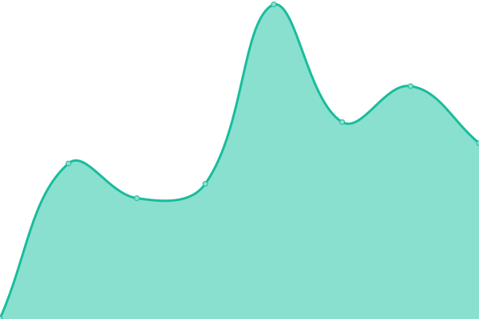

# [📈 Live Status](https://status.zlendy.com): <!--live status--> **🟩 All systems operational**

This repository contains the open-source uptime monitor and status page for [Zlendy](https://zlendy.com), powered by [Upptime](https://github.com/upptime/upptime).

With [Upptime](https://upptime.js.org), you can get your own unlimited and free uptime monitor and status page, powered entirely by a GitHub repository. We use [Issues](https://github.com/Zlendy/upptime/issues) as incident reports, [Actions](https://github.com/Zlendy/upptime/actions) as uptime monitors, and [Pages](https://status.zlendy.com) for the status page.

<!--start: status pages-->
<!-- This summary is generated by Upptime (https://github.com/upptime/upptime) -->
<!-- Do not edit this manually, your changes will be overwritten -->
<!-- prettier-ignore -->
| URL | Status | History | Response Time | Uptime |
| --- | ------ | ------- | ------------- | ------ |
|  [Personal website](https://zlendy.com) | 🟩 Up | [personal-website.yml](https://github.com/Zlendy/status.zlendy.com/commits/HEAD/history/personal-website.yml) | 

 181ms
     
 | 

<a href="https://status.zlendy.com/history/personal-website">100.00%</a>
    

|  [Personal API](https://api.zlendy.com/) | 🟩 Up | [personal-api.yml](https://github.com/Zlendy/status.zlendy.com/commits/HEAD/history/personal-api.yml) | 

 459ms
     
 | 

<a href="https://status.zlendy.com/history/personal-api">98.65%</a>
    

|  [Sharkey](https://social.zlendy.com) | 🟩 Up | [sharkey.yml](https://github.com/Zlendy/status.zlendy.com/commits/HEAD/history/sharkey.yml) | 

 423ms
     
 | 

<a href="https://status.zlendy.com/history/sharkey">98.65%</a>
    

|  [Umami Analytics](https://tomato.zlendy.com) | 🟩 Up | [umami-analytics.yml](https://github.com/Zlendy/status.zlendy.com/commits/HEAD/history/umami-analytics.yml) | 

 645ms
     
 | 

<a href="https://status.zlendy.com/history/umami-analytics">98.65%</a>
    

|  [Pterodactyl](https://panel.zlendy.com) | 🟩 Up | [pterodactyl.yml](https://github.com/Zlendy/status.zlendy.com/commits/HEAD/history/pterodactyl.yml) | 

 529ms
     
 | 

<a href="https://status.zlendy.com/history/pterodactyl">98.65%</a>
    

<!--end: status pages-->

[**Visit our status website →**](https://status.zlendy.com)

## 📄 License

- Powered by: [Upptime](https://github.com/upptime/upptime)
- Code: [MIT](./LICENSE) © [Anand Chowdhary](https://anandchowdhary.com), supported by [Pabio](https://pabio.com)
- Data in the `./history` directory: [Open Database License](https://opendatacommons.org/licenses/odbl/1-0/)
